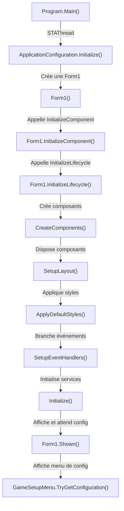

# Documentation Complète du Projet Gomoku Game

## 📋 Table des Matières

1. [Vue d'Ensemble Générale](#vue-densemble-générale)
2. [Flux d'Exécution Complet](#flux-dexécution-complet)
3. [Architecture et Composants](#architecture-et-composants)
4. [Documentation Détaillée des Classes](#documentation-détaillée-des-classes)

---

## 1️⃣ Vue d'Ensemble Générale

### 🎯 Objectif du Projet

**Gomoku Game** est une implémentation d'un jeu de stratégie en C# WinForms où deux joueurs placent des pions ou lancent des bombes pour former des lignes de 5 points alignés.

### 🏗️ Architecture Globale

```
┌─────────────────────────────────────────────────────────────┐
│                     PRESENTATION LAYER (UI)                  │
│  Form1.cs (Orchestration) -> GameBoard (Rendu) -> GamePoint  │
└──────────────────┬──────────────────────────────────────────┘
                   │
┌──────────────────┴──────────────────────────────────────────┐
│                  BUSINESS LOGIC LAYER                        │
│  GomokuEngine (Moteur) -> TurnDetector -> EtatPartie        │
└──────────────────┬──────────────────────────────────────────┘
                   │
┌──────────────────┴──────────────────────────────────────────┐
│                  PERSISTENCE LAYER (DATA)                    │
│  PartieService -> ActionService -> DatabaseManager           │
└─────────────────────────────────────────────────────────────┘
```

### 🎮 Les Trois Piliers du Jeu

1. **Point d'Entrée** : `Program.cs` → Initialise WinForms et ouvre `Form1`
2. **Moteur Logique** : `GomokuEngine.cs` → Valide les mouvements et détecte les lignes gagnantes
3. **Interface Utilisateur** : `Form1.cs` → Orchestre les interactions, `GameBoard.cs` → Affiche le plateau

---

## 2️⃣ Flux d'Exécution Complet

### 🚀 Phase 1 : Démarrage de l'Application



### 📊 Phase 2 : Initialisation de la Partie

**Point d'entrée** : `GameSetupMenu.TryGetConfiguration()`
**Sortie** : `GameSetupResult` avec joueurs et dimensions

```
┌────────────────────────────────────────────────────┐
│ GameSetupMenu.TryGetConfiguration()                │
│  ├─ Affiche une boîte de dialogue                 │
│  ├─ Récupère nom du Joueur 1 et Joueur 2         │
│  ├─ Récupère dimensions de grille (10x10, 15x15) │
│  └─ Retourne GameSetupResult ou null             │
└────────────────────────────────────────────────────┘
           ↓
┌────────────────────────────────────────────────────┐
│ Form1.StartFromSetup(setup)                        │
│  ├─ Sauvegarde joueurs et dimensions              │
│  ├─ Crée GomokuEngine(width, height)              │
│  ├─ Crée TurnDetector(player1, player2)           │
│  ├─ Crée EtatPartie() et appelle StartGame()      │
│  ├─ Configure le plateau visuel (grid size)       │
│  ├─ Sauvegarde la partie en BD via PartieService  │
│  └─ Passe à PromptCurrentTurnAction()             │
└────────────────────────────────────────────────────┘
```

### 🎲 Phase 3 : Boucle de Jeu - Classification des Actions

#### **Action 1: Placement d'un Point**

```
Flux Utilisateur:
┌────────────────────────────────────────────────────┐
│ 1. Form1.Board_MouseClick() détecte un clic       │
└────────────────────────────────────────────────────┘
           ↓
┌────────────────────────────────────────────────────┐
│ 2. Conversion pixel → coordonnées grille          │
│    x = (pixelX - BoardMargin) / CellSize          │
│    y = (pixelY - BoardMargin) / CellSize          │
└────────────────────────────────────────────────────┘
           ↓
┌────────────────────────────────────────────────────┐
│ 3. GomokuEngine.TryPlaceStone(x, y, color)        │
│    ├─ TryPlaceStone() retourne:                   │
│    │  - Stone placé                               │
│    │  - Nouvelles lignes de 5 (si présentes)     │
│    └─ ProtectPointsFromNewWinningLines() marque  │
│       les points comme invulnérables aux bombes   │
└────────────────────────────────────────────────────┘
           ↓
┌────────────────────────────────────────────────────┐
│ 4. Form1 synchronise le visuel et le score        │
│    ├─ SyncPointsFromEngine()                      │
│    ├─ SyncWinningLines() + UpdateScoresFromLines()│
│    └─ Sauvegarde en BD via ActionService          │
└────────────────────────────────────────────────────┘
           ↓
┌────────────────────────────────────────────────────┐
│ 5. MoveToNextTurn()                               │
│    ├─ TurnDetector.AdvanceTurn() bascule joueur  │
│    ├─ TurnNumber++                                │
│    └─ PromptCurrentTurnAction() pour le nouveau   │
└────────────────────────────────────────────────────┘
```

#### **Action 2: Tir Canon (Bombe)**

```
Étape 1: Sélection de l'action "Tirer"
┌────────────────────────────────────────────────────┐
│ Form1.ShootButton_Click()                          │
│  └─ TurnDetector.SetCurrentAction(LaunchBomb)     │
│  └─ GameBoard.EnableBombSelection(fromLeft=...)    │
└────────────────────────────────────────────────────┘

Étape 2: Clic sur un canon
┌────────────────────────────────────────────────────┐
│ Form1.Board_MouseClick() → HandleBombRowSelection()│
│  └─ TryGetBombRowFromClick() trouve la ligne      │
│  └─ Sauvegarde row dans _pendingBombRowOneBased   │
└────────────────────────────────────────────────────┘

Étape 3: Clavier Ctrl + numéro (1-9)
┌────────────────────────────────────────────────────┐
│ Form1.Form1_KeyDown() détecte Ctrl + numpad/D1-9  │
│  └─ TryMapPowerFromKey() retourne puissance (1-9) │
└────────────────────────────────────────────────────┘

Étape 4: Moteur applique bombe
┌────────────────────────────────────────────────────┐
│ GomokuEngine.TryLaunchBomb(                        │
│     fromLeft, rowOneBased, power,                  │
│     shooterColor                                  │
│ )                                                  │
│  ├─ Résout cible: (x,y) via mapping puissance     │
│  ├─ TryApplyBombAtTarget():                       │
│  │  ├─ Vérifie si point protected (=no effect)    │
│  │  ├─ Vérifie si point contient pion adverse     │
│  │  ├─ Supprime le pion si trouvé                 │
│  │  └─ Retourne GetWinningLinesExactFive()        │
│  └─ Affiche croix éphémère                        │
└────────────────────────────────────────────────────┘

Étape 5: Sauvegarde et passage tour
┌────────────────────────────────────────────────────┐
│ ActionService.TryRecordBombAction() → BD           │
│ MoveToNextTurn() → PromptCurrentTurnAction()       │
└────────────────────────────────────────────────────┘
```

#### **Action 3: Annulation du Dernier Coup (Ctrl+Z)**

```
Flux:
┌────────────────────────────────────────────────────┐
│ Form1.Form1_KeyDown() → Ctrl+Z → UndoLastRound()  │
└────────────────────────────────────────────────────┘
           ↓
┌────────────────────────────────────────────────────┐
│ 1. Suppression du dernier coup en BD               │
│    ActionService.TryDeleteLastActions(id, count=1) │
└────────────────────────────────────────────────────┘
           ↓
┌────────────────────────────────────────────────────┐
│ 2. Reconstruction du moteur depuis l'historique    │
│    RebuildEngineFromHistory()                      │
│    ├─ Vide moteur                                 │
│    ├─ Rejoue tous les coups sauvegardés           │
│    └─ Récalcule tous les points et lignes         │
└────────────────────────────────────────────────────┘
           ↓
┌────────────────────────────────────────────────────┐
│ 3. Synchronise UI et retour au tour précédent      │
│    SyncPointsFromEngine() + SyncWinningLines()     │
│    TurnDetector.AdvanceTurn() (backwards)          │
└────────────────────────────────────────────────────┘
```

---

## 3️⃣ Architecture et Composants

### Couche Métier (Core)

#### **GomokuEngine** - Le Cœur du Jeu

**Responsabilités** :
- Gestion de l'état du plateau (positions des pierres)
- Détection des lignes gagnantes (5 points alignés)
- Protection des points des lignes gagnantes contre les bombes
- Calcul de l'impact des bombes

**Data Structures Clés** :
```csharp
private Dictionary<Point, GameStone> _stonesByPosition;    // Rapide lookup: est-ce occupé?
private List<GameStone> _stones;                           // Historique pour rejouer
private HashSet<Point> _protectedWinningPoints;            // Points invulnérables
private List<WinningLine> _registeredWinningLines;          // Lignes validées
private Dictionary<(int Dx, int Dy), HashSet<Point>> 
    _linePointsByDirection;                                 // Prévient réutilisation même-direction
```

#### **TurnDetector** - Gestion des Tours

**Responsabilités** :
- Savoir quel joueur joue actuellement
- Savoir quelle action (placer point ou bombe) est sélectionnée
- Alterner les joueurs après chaque coup

**États** :
```csharp
CurrentPlayer:   String (Player1 ou Player2)
CurrentAction:   TurnAction (PlacePoint ou LaunchBomb)
```

#### **EtatPartie** - État Global du Jeu

**Responsabilités** :
- Tracker si la partie est en cours ou finie
- Empêcher les interactions après la fin

**États** :
```csharp
Status: EtatPartieStatus
    ├─ NotStarted  (avant initialisation)
    ├─ EnCours     (pendant jeu)
    └─ Finie       (après fin explicite)
```

### Couche Présentation (UI)

#### **Form1** - Principal Orchestrateur

**Responsabilités** :
- Gère tout le cycle de vie du jeu (setup → jeu → fin)
- Traduit clics/clavier en actions de jeu
- Maintient l'état UI synchronisé avec le moteur
- Persiste et rejoue les actions via les services

**Structure de Composants** :
```
Form1 (Panel principal)
├─ _topPanel (height=44)
│  └─ _turnStatusLabel (affiche le tour courant)
├─ _boardHostPanel (zone centrale)
│  └─ _board (GameBoard custom control)
└─ _bottomPanel (height=104, 2 rangées de boutons)
   ├─ Rangée 1: PlacePointButton, ShootButton
   └─ Rangée 2: UndoButton, EndGameButton
```

**Propriétés Importantes** :
```csharp
// Moteur métier
GomokuEngine _engine;
TurnDetector _turnDetector;
EtatPartie _etatPartie;

// État de partie
string _player1Name, _player2Name;
int _gridWidth = 10, _gridHeight = 10;
int _player1Score, _player2Score;
int _turnNumber = 1;

// Historique local (source de vérité)
List<ActionModel> _actionHistory;

// Garde-fou: éviter double-comptage des lignes
HashSet<string> _awardedLineSignatures;
HashSet<string> _displayedLineSignatures;
```

#### **GameBoard** - Rendu du Plateau

**Responsabilités** :
- Dessiner grille, points, lignes gagnantes, canons
- Gérer croix éphémère des tirs
- Convertir clic pixel → coordonnées grille

**Propriétés Visuelles** :
```csharp
int GridColumns = 10, GridRows = 10;         // Dimensions logiques
int CellSize = 40;                           // Pixels par cellule
int BoardMargin = 50;                        // Marge autour grille
int CannonOffset = 26;                       // Distance canon/bord grille
```

**Données Affichées** :
```csharp
List<GamePoint> PlacedPoints;                // Pions à dessiner
List<(Point Start, Point End, Color)> 
    WinningLines;                            // Lignes gagnantes
bool IsBombSelectionActive;                  // Mode sélection bombe?
int? SelectedBombRowOneBased;                // Quelle ligne sélectionnée?
```

#### **GamePoint** - Atome Visuelle

**Responsabilités** :
- Représenter un pion unique
- Savoir se dessiner à une position pixel donnée

**Propriétés** :
```csharp
Point Coordinates;         // Position logique (x,y) sur grille
Color PointColor;          // Couleur (Blue ou Red)
int _visualSize = 30;      // Rayon en pixels
```

#### **BaseComponent** - Classe de Base UI

**Responsabilités** :
- Impliquer un cycle de vie cohérent pour tous les composants
- Forcer CreateComponents → SetupLayout → ApplyDefaultStyles → SetupEventHandlers → Initialize

### Couche Persistance (Data / Service)

#### **PartieService** - Gestion des Parties

**Méthodes Principales** :
```csharp
int TryCreatePartie(string player1, string player2, int width, int height)
    → Sauvegarde partie en BD, retourne id

IReadOnlyList<PartieModel> TryGetParties()
    → Récupère toutes les parties enregistrées

PartieModel? TryGetPartieById(int id)
    → Récupère une partie par id
```

#### **ActionService** - Historique des Coups

**Méthodes Principales** :
```csharp
bool TryRecordPointAction(int partieId, string playerName, int x, int y, int tour)
    → Enregistre placement d'un point

bool TryRecordBombAction(int partieId, string playerName, int x, int y, int tour)
    → Enregistre un tir canon

IReadOnlyList<ActionModel> TryGetByPartieId(int partieId)
    → Récupère tous les coups ordonnés par tour

bool TryDeleteLastActions(int partieId, int count)
    → Supprime les N derniers coups (utilisé par Undo)
```

#### **DatabaseManager** - Point d'Accès Données

**Responsabilités** :
- Fournit chaîne de connexion PostgreSQL
- Expose GenericRepository pour requêtes SQL

---

## 4️⃣ Documentation Détaillée des Classes

### 🔵 Program.cs

**Rôle** : Point d'entrée de l'application WinForms

```csharp
namespace _;

using GomokuGame.ui;

static class Program
{
    [STAThread]
    static void Main()
    {
        // STAThread: Single-Threaded Apartment (requis pour WinForms)
        // Initialise la configuration de l'application (DPI, police, thème)
        ApplicationConfiguration.Initialize();
        
        // Lance la boucle d'événements WinForms avec Form1 comme fenêtre principale
        Application.Run(new Form1());
        
        // La boucle s'arrête quand Form1 se ferme
    }    
}
```

**Flux** :
1. CLR appelle `Program.Main()`
2. `ApplicationConfiguration.Initialize()` configure les paramètres globaux WinForms
3. `new Form1()` instancie la fenêtre principale
4. `Application.Run()` lance la boucle d'événements (bloquant)
5. Retour quand l'utilisateur ferme la fenêtre

**Sortie** : Application fermée

---

### 🟦 Form1.cs - Orchestrateur Principal

**Rôle** : Centre nerveux de toute l'interaction utilisateur

#### **Cycle de Vie (InitializeComponent + InitializeLifecycle)**

```csharp
public Form1()
{
    TerminalLogger.Initialize();  // Prépare console debug
    InitializeComponent();        // Generated by designer (création de la Form)
    InitializeLifecycle();        // Notre initialisation personnalisée
}

private void InitializeLifecycle()
{
    CreateComponents();           // Instancie UI controls
    SetupLayout();               // Configure tailles/positions
    ApplyDefaultStyles();        // Applique couleurs/polices
    SetupEventHandlers();        // Branche les événements
    Initialize();                // Initialise services métier
}
```

#### **CreateComponents() - Instanciation des Contrôles**

```csharp
private void CreateComponents()
{
    // --- Création des composants ---
    _board = new GameBoard();                           // Plateau custom
    _topPanel = new Panel();                           // Barre supérieure (44px)
    _turnStatusLabel = new Label();                    // Affiche tour courant
    _bottomPanel = new Panel();                        // Barre inférieure (104px)
    
    // --- Configuration TopPanel ---
    _topPanel.Dock = DockStyle.Top;
    _topPanel.Height = 44;
    _topPanel.Padding = new Padding(12, 8, 12, 8);   // Marges internes
    _turnStatusLabel.Dock = DockStyle.Fill;
    _turnStatusLabel.Font = new Font("Segoe UI", 10, FontStyle.Bold);
    _turnStatusLabel.Text = "Tour en attente...";
    _topPanel.Controls.Add(_turnStatusLabel);
    
    // --- Configuration BottomPanel (2 rangées de boutons) ---
    _bottomPanel.Height = 104;
    TableLayoutPanel bottomLayout = new TableLayoutPanel
    {
        ColumnCount = 1,
        RowCount = 2
        // Chaque rangée = 50% de hauteur
    };
    
    // Rangée 1: PlacePointButton + ShootButton
    FlowLayoutPanel topButtonsRow = new FlowLayoutPanel { ... };
    _placePointButton.Width = 120; _placePointButton.Text = "Placer point";
    _shootButton.Width = 90;       _shootButton.Text = "Tirer";
    topButtonsRow.Controls.Add(_placePointButton);
    topButtonsRow.Controls.Add(_shootButton);
    
    // Rangée 2: UndoButton + EndGameButton
    FlowLayoutPanel bottomButtonsRow = new FlowLayoutPanel { ... };
    _undoButton.Width = 140;         _undoButton.Text = "Retour (Ctrl+Z)";
    _endGameButton.Width = 180;      _endGameButton.Text = "Terminer la partie";
    bottomButtonsRow.Controls.Add(_undoButton);
    bottomButtonsRow.Controls.Add(_endGameButton);
    
    // Assemblage
    bottomLayout.Controls.Add(topButtonsRow, 0, 0);
    bottomLayout.Controls.Add(bottomButtonsRow, 0, 1);
    _bottomPanel.Controls.Add(bottomLayout);
    
    // Ajout au Form principal
    this.Controls.Add(_topPanel);
    this.Controls.Add(_boardHostPanel);  // Centrale, elle grandit
    this.Controls.Add(_bottomPanel);
    
    // Timer pour animation croix éphémère (fade)
    _shotTraceTimer.Interval = 35;  // ~28 fps
}
```

#### **SetupEventHandlers() - Branchement des Événements**

```csharp
private void SetupEventHandlers()
{
    // --- Événements souris ---
    _board.MouseClick += Board_MouseClick;           // Clic sur plateau
    
    // --- Événements boutons ---
    _placePointButton.Click += PlacePointButton_Click;
    _shootButton.Click += ShootButton_Click;
    _endGameButton.Click += EndGameButton_Click;
    _undoButton.Click += UndoButton_Click;
    
    // --- Événements clavier ---
    this.KeyPreview = true;                          // Intercepter clavier avant contrôles enfants
    this.KeyDown += Form1_KeyDown;                   // Ctrl+Z, Ctrl+numpad
    
    // --- Événements fenêtre ---
    this.Shown += Form1_Shown;                        // Quand fenêtre affichée
    this.Resize += Form1_Resize;                      // Redimensionnement
    
    // --- Événements de timer ---
    _shotTraceTimer.Tick += ShotTraceTimer_Tick;     // Animation croix éphémère
}
```

#### **Form1_Shown() - Initialisation Post-Affichage**

```csharp
private void Form1_Shown(object? sender, EventArgs e)
{
    // Affichée une seule fois
    if (_isGameInitialized)
        return;
    
    // Affiche menu de configuration
    if (!GameSetupMenu.TryGetConfiguration(this, out GameSetupResult? setup) || setup is null)
    {
        // Utilisateur a cliqué Cancel
        this.Close();
        return;
    }
    
    // Configuration reçue, lance la partie
    StartFromSetup(setup);
}
```

#### **StartFromSetup(GameSetupResult setup) - Initialisation Partie**

```csharp
private void StartFromSetup(GameSetupResult setup)
{
    // === Sauvegarde métadonnées ===
    _player1Name = setup.Player1;
    _player2Name = setup.Player2;
    _gridWidth = setup.GridWidth;
    _gridHeight = setup.GridHeight;
    _player1Score = 0;
    _player2Score = 0;
    _turnNumber = 1;
    _actionHistory.Clear();
    _awardedLineSignatures.Clear();
    _displayedLineSignatures.Clear();
    
    // === Crée objet métier ===
    _engine = new GomokuEngine(_gridWidth, _gridHeight);
    _turnDetector = new TurnDetector(_player1Name, _player2Name);
    _etatPartie = new EtatPartie();
    _etatPartie.StartGame();  // Passe l'état à "EnCours"
    
    // === Configure visuel plateau ===
    _board.GridColumns = _gridWidth;
    _board.GridRows = _gridHeight;
    _board.PlacedPoints.Clear();
    _board.WinningLines.Clear();
    
    // === Adapte fenêtre à plateau ===
    Size boardSize = _board.GetRequiredPixelSize();
    this.Width = boardSize.Width;
    this.Height = boardSize.Height;
    CenterBoardInHost();
    
    // === Sauvegarde partie en BD ===
    _currentPartieId = _partieService.TryCreatePartie(
        _player1Name,
        _player2Name,
        _gridWidth,
        _gridHeight
    );
    
    // === Lance la boucle de jeu ===
    _isGameInitialized = true;
    PromptCurrentTurnAction();  // Affiche "Tour de Player1"
}
```

#### **Board_MouseClick() - Gestion Clic Souris**

```csharp
private void Board_MouseClick(object? sender, MouseEventArgs e)
{
    // === Guards: jeu pas commencé ou fini ===
    if (!_isGameInitialized || !_etatPartie.IsInProgress)
        return;
    
    // === Mode bombe: clic sert à choisir ligne ===
    if (_turnDetector.CurrentAction == TurnAction.LaunchBomb)
    {
        HandleBombRowSelection(e.X, e.Y);
        return;
    }
    
    // === Mode point normal: clic pose un pion ===
    // Convertir pixels → coordonnées grille
    int x = (int)Math.Round((float)(e.X - _board.BoardMargin) / _board.CellSize);
    int y = (int)Math.Round((float)(e.Y - _board.BoardMargin) / _board.CellSize);
    
    // Vérifier dans les limites
    if (!(x >= 0 && x < _board.GridColumns && y >= 0 && y < _board.GridRows))
        return;
    
    // Détermine couleur en fonction du joueur
    Color stoneColor = (_turnDetector.CurrentPlayer == _player1Name) ? Color.Blue : Color.Red;
    
    // === Appel moteur ===
    bool success = _engine.TryPlaceStone(
        x, y, stoneColor,
        out GameStone? placedStone,
        out IReadOnlyList<WinningLine> newWinningLines
    );
    
    if (!success)
        return;  // Case occupée, etc.
    
    // === Synchronise UI ===
    SyncPointsFromEngine();       // Redessine tous pions
    SyncWinningLines(newWinningLines);  // Dessine nouvelles lignes
    
    // === BD: enregistre coup ===
    _actionService.TryRecordPointAction(
        _currentPartieId,
        _turnDetector.CurrentPlayer,
        x, y,
        _turnNumber
    );
    AddActionToHistory("POINT", _turnDetector.CurrentPlayer, x, y, _turnNumber);
    
    // === Passage tour ===
    _board.Invalidate();
    MoveToNextTurn();
}
```

#### **Form1_KeyDown() - Gestion Clavier**

```csharp
private void Form1_KeyDown(object? sender, KeyEventArgs e)
{
    // === Ctrl+Z: Annulation ===
    if (e.Control && e.KeyCode == Keys.Z)
    {
        e.Handled = true;
        e.SuppressKeyPress = true;
        UndoLastRound();
        return;
    }
    
    // === Ctrl + numpad/D1-9: Puissance bombe ===
    if (_turnDetector.CurrentAction != TurnAction.LaunchBomb)
        return;
    
    if (!_pendingBombRowOneBased.HasValue)
        return;  // Pas de ligne sélectionnée
    
    // Mappe Keys.D1..D9 et Keys.NumPad1..9 vers 1..9
    int? power = TryMapPowerFromKey(e.KeyCode, e.Control);
    if (!power.HasValue)
        return;
    
    // === Prépare paramètres tir ===
    bool fromLeft = (_turnDetector.CurrentPlayer == _turnDetector.Player1);
    Color shooterColor = fromLeft ? Color.Blue : Color.Red;
    
    // === Appel moteur ===
    bool success = _engine.TryLaunchBomb(
        fromLeft,
        _pendingBombRowOneBased.Value,
        power.Value,
        shooterColor,
        out Point targetCell,
        out GameStone? removedStone,
        out bool hitProtectedWinningPoint,
        out IReadOnlyList<WinningLine> currentWinningLines
    );
    
    if (!success)
    {
        MoveToNextTurn();
        return;
    }
    
    // === Synchronise UI ===
    SyncPointsFromEngine();
    SyncWinningLines(currentWinningLines);
    
    // === Affiche croix éphémère (fade effect) ===
    _board.ShowTransientShotMarker(targetCell, shooterColor);
    _shotTraceTimer.Stop();
    _shotTraceTimer.Start();  // Lance animation 35ms
    
    // === BD: enregistre coup ===
    _actionService.TryRecordBombAction(
        _currentPartieId,
        _turnDetector.CurrentPlayer,
        targetCell.X,
        targetCell.Y,
        _turnNumber
    );
    AddActionToHistory("BOMBE", _turnDetector.CurrentPlayer, targetCell.X, targetCell.Y, _turnNumber);
    
    // === Passage tour ===
    _board.Invalidate();
    e.Handled = true;
    e.SuppressKeyPress = true;
    MoveToNextTurn();
}

private static int? TryMapPowerFromKey(Keys key, bool isCtrlPressed)
{
    if (!isCtrlPressed)
        return null;
    
    return key switch
    {
        Keys.D1 => 1, Keys.D2 => 2, Keys.D3 => 3, ... Keys.D9 => 9,  // QWERTY top row
        Keys.NumPad1 => 1, ... Keys.NumPad9 => 9,                     // Numpad
        _ => null
    };
}
```

#### **MoveToNextTurn() - Passage au Tour Suivant**

```csharp
private void MoveToNextTurn()
{
    // === Réinitialise état bombe ===
    _pendingBombRowOneBased = null;
    _board.DisableBombSelection();
    
    // === Guards ===
    if (!_etatPartie.IsInProgress)
        return;
    
    // === Avance le tour ===
    _turnDetector.AdvanceTurn();  // Bascule joueur + reset action
    _turnNumber++;
    
    // === Affiche prompt du nouveau joueur ===
    PromptCurrentTurnAction();
}

private void PromptCurrentTurnAction()
{
    if (!_etatPartie.IsInProgress)
        return;
    
    // Actualise UI: boutons, label
    ApplyActionSelectionUi();
}

private void ApplyActionSelectionUi()
{
    // === Réinitialise sélection actions ===
    _turnDetector.SetCurrentAction(TurnAction.PlacePoint);
    _board.DisableBombSelection();
    _pendingBombRowOneBased = null;
    
    // === Active boutons et affiche message ===
    _placePointButton.Enabled = true;
    _shootButton.Enabled = true;
    _undoButton.Enabled = true;
    _endGameButton.Enabled = true;
    
    UpdateTurnStatusText($"Tour de {_turnDetector.CurrentPlayer} - Action: ")
}
```

#### **Synchronisation: SyncPointsFromEngine() et SyncWinningLines()**

```csharp
private void SyncPointsFromEngine()
{
    // Remplace la liste UI par l'état exact du moteur
    _board.PlacedPoints.Clear();
    
    foreach (GameStone stone in _engine.Stones)
    {
        _board.PlacedPoints.Add(
            new GamePoint(stone.X, stone.Y, stone.Color)
        );
    }
}

private void SyncWinningLines(IReadOnlyList<WinningLine> newLines)
{
    // Ajoute à affichage uniquement si pas déjà affichée
    foreach (WinningLine line in newLines)
    {
        string signature = BuildLineSignature(line);
        
        if (_displayedLineSignatures.Add(signature))
        {
            _board.WinningLines.Add((line.Start, line.End, line.Color));
            TerminalLogger.Action($"Ligne affichée: {signature}");
        }
    }
    
    UpdateScoresFromLines(newLines);
}

private void UpdateScoresFromLines(IReadOnlyList<WinningLine> newLines)
{
    // Incrémente score uniquement 1ère apparition (évite double-comptage)
    foreach (WinningLine line in newLines)
    {
        string signature = BuildLineSignature(line);
        
        if (!_awardedLineSignatures.Add(signature))
            continue;  // Déjà comptégée
        
        if (line.Color == Color.Blue)
        {
            _player1Score++;
            TerminalLogger.Action($"Score: {_player1Name} +1 (total={_player1Score})");
        }
        else if (line.Color == Color.Red)
        {
            _player2Score++;
            TerminalLogger.Action($"Score: {_player2Name} +1 (total={_player2Score})");
        }
    }
}

private static string BuildLineSignature(WinningLine line)
{
    // Crée une clé unique pour une ligne
    // Exemple: "-1234234|1,2|5,6"  (couleur|startPoint|endPoint)
    Point a = line.Start;
    Point b = line.End;
    
    // Normalise direction (toujours petit avant grand)
    bool swap = a.X > b.X || (a.X == b.X && a.Y > b.Y);
    Point first = swap ? b : a;
    Point second = swap ? a : b;
    
    return $"{line.Color.ToArgb()}|{first.X},{first.Y}|{second.X},{second.Y}";
}
```

---

### 🟩 GomokuEngine.cs - Moteur Logique du Jeu

**Rôle** : Valide les mouvements et détecte les lignes gagnantes

#### **Initialisation**

```csharp
public sealed class GomokuEngine
{
    // === État interne du plateau ===
    private readonly Dictionary<Point, GameStone> _stonesByPosition;
    private readonly List<GameStone> _stones;
    
    // === Gestion lignes ===
    private readonly HashSet<Point> _protectedWinningPoints;
    private readonly List<WinningLine> _registeredWinningLines;
    
    // === Direction-aware: prévient réutilisation même direction ===
    private readonly Dictionary<(int Dx, int Dy), HashSet<Point>> 
        _linePointsByDirection;
    
    private readonly (int Dx, int Dy)[] _scanDirections =
    {
        (1, 0),      // Horizontal (→)
        (0, 1),      // Vertical (↓)
        (1, 1),      // Diagonal ↘
        (1, -1)      // Diagonal ↗
    };
    
    public int GridWidth { get; }
    public int GridHeight { get; }
    public IReadOnlyList<GameStone> Stones => _stones;
    
    public GomokuEngine(int gridWidth, int gridHeight)
    {
        GridWidth = gridWidth;
        GridHeight = gridHeight;
        
        // Initialise dicts par direction
        foreach (var direction in _scanDirections)
        {
            _linePointsByDirection[direction] = new HashSet<Point>();
        }
        
        TerminalLogger.Action($"Engine initialized: {gridWidth}x{gridHeight}");
    }
}
```

#### **TryPlaceStone() - Placer une Pierre**

```csharp
public bool TryPlaceStone(
    int x, int y, Color stoneColor,
    out GameStone? placedStone,
    out IReadOnlyList<WinningLine> newWinningLines
)
{
    placedStone = null;
    newWinningLines = new List<WinningLine>();
    
    // === Validations ===
    if (!IsInsideBoard(x, y))
    {
        TerminalLogger.Action($"Rejeté: ({x},{y}) hors limites");
        return false;
    }
    
    var position = new Point(x, y);
    if (_stonesByPosition.ContainsKey(position))
    {
        TerminalLogger.Action($"Rejeté: ({x},{y}) déjà occupé");
        return false;
    }
    
    // === Crée et stocke pierre ===
    var stone = new GameStone(x, y, stoneColor);
    _stones.Add(stone);
    _stonesByPosition[position] = stone;
    
    placedStone = stone;
    
    // === Détecte nouvelles lignes de 5 ===
    newWinningLines = FindNewWinningLines(stone);
    
    // === Protège points de ces lignes ===
    ProtectPointsFromNewWinningLines(newWinningLines);
    
    TerminalLogger.Action(
        $"Pierre posée: ({x},{y}), couleur={stoneColor.Name}, " +
        $"lignes trouvées={newWinningLines.Count}"
    );
    
    return true;
}

private bool IsInsideBoard(int x, int y)
{
    return x >= 0 && x < GridWidth && y >= 0 && y < GridHeight;
}

private bool HasSameColorStoneAt(int x, int y, Color color)
{
    if (!IsInsideBoard(x, y))
        return false;
    
    var p = new Point(x, y);
    return _stonesByPosition.TryGetValue(p, out GameStone? stone) 
        && stone.Color == color;
}
```

#### **FindNewWinningLines() - Détection des Lignes**

```csharp
private List<WinningLine> FindNewWinningLines(GameStone originStone)
{
    var lines = new List<WinningLine>();
    
    // Scan 4 directions depuis la pierre nouvellement posée
    foreach (var (dx, dy) in _scanDirections)
    {
        // Collecte segment continu dans cette direction
        List<Point> alignedRun = CollectAlignedRunPoints(originStone, dx, dy);
        
        // Trouve index de la pierre d'origine
        int originIndex = alignedRun.FindIndex(
            p => p.X == originStone.X && p.Y == originStone.Y
        );
        
        TerminalLogger.Action(
            $"Direction ({dx},{dy}): alignedRun length={alignedRun.Count}, " +
            $"originIndex={originIndex}"
        );
        
        // Need at least 5 stones and origin must be included
        if (alignedRun.Count < 5 || originIndex < 0)
            continue;
        
        // === Cherche blocs de 5 exacts ===
        // Exemple: si run = [A,B,C,D,E,F,G,H,I,J] (10 pierres)
        // On cherche:
        //   - [A,B,C,D,E] à [B,C,D,E,F] à [C,D,E,F,G] ... etc
        // Mais saute par 5 à la fois pour non-chevauchement
        
        for (int startIndex = 0; startIndex + 4 < alignedRun.Count; startIndex += 5)
        {
            int endIndex = startIndex + 4;
            
            // === Vérifie que la pierre nouvelle est dans ce bloc ===
            bool includesOrigin = originIndex >= startIndex 
                                && originIndex <= endIndex;
            
            if (!includesOrigin)
                continue;
            
            // === Prévient réutilisation même-direction ===
            if (OverlapsExistingLineInSameDirection(
                alignedRun, startIndex, endIndex, dx, dy))
            {
                TerminalLogger.Action(
                    $"Bloc rejeté (overlap même direction): " +
                    $"startIndex={startIndex}"
                );
                continue;
            }
            
            // === Création ligne validée ===
            Point start = alignedRun[startIndex];
            Point end = alignedRun[endIndex];
            lines.Add(new WinningLine(start, end, originStone.Color));
            
            TerminalLogger.Action(
                $"Ligne 5 trouvée: ({start.X},{start.Y}) → ({end.X},{end.Y})"
            );
        }
    }
    
    return lines;
}

private List<Point> CollectAlignedRunPoints(GameStone originStone, int dx, int dy)
{
    // Collecte un segment continu de même couleur aligné
    var runPoints = new List<Point>();
    
    int startX = originStone.X;
    int startY = originStone.Y;
    
    // Recule jusqu'au premier point
    while (HasSameColorStoneAt(startX - dx, startY - dy, originStone.Color))
    {
        startX -= dx;
        startY -= dy;
    }
    
    // Avance et collecte
    int x = startX;
    int y = startY;
    
    while (true)
    {
        if (!HasSameColorStoneAt(x, y, originStone.Color))
            break;
        
        runPoints.Add(new Point(x, y));
        x += dx;
        y += dy;
    }
    
    return runPoints;
}

private bool OverlapsExistingLineInSameDirection(
    List<Point> points, int startIndex, int endIndex, int dx, int dy)
{
    // === Clé direction normalisée ===
    (int Dx, int Dy) key = NormalizeDirection(dx, dy);
    HashSet<Point> existingPoints = _linePointsByDirection[key];
    
    // === Vérifie si un point du bloc rejeté existe déjà ===
    for (int i = startIndex; i <= endIndex; i++)
    {
        Point p = points[i];
        if (existingPoints.Contains(p))
            return true;  // Overlap détecté
    }
    
    return false;
}

private (int Dx, int Dy) NormalizeDirection(int dx, int dy)
{
    // Canonicalise direction: toujours dx≥0
    // Exemples:
    //   (1,0) → (1,0)
    //   (-1,0) → (1,0)
    //   (0,-1) → (0,1)
    
    if (dx < 0)
    {
        dx = -dx;
        dy = -dy;
    }
    else if (dx == 0 && dy < 0)
    {
        dy = -dy;
    }
    
    return (dx, dy);
}

private void ProtectPointsFromNewWinningLines(IReadOnlyList<WinningLine> newWinningLines)
{
    // === Enregistre chaque nouvelle ligne ===
    foreach (WinningLine line in newWinningLines)
    {
        _registeredWinningLines.Add(line);
        
        // Calcule direction normalisée
        int directionDx = Math.Sign(line.End.X - line.Start.X);
        int directionDy = Math.Sign(line.End.Y - line.Start.Y);
        (int Dx, int Dy) directionKey = NormalizeDirection(directionDx, directionDy);
        
        // === Marque tous les 5 points comme protégés ===
        foreach (Point p in EnumerateLinePoints(line))
        {
            if (_protectedWinningPoints.Add(p))
            {
                TerminalLogger.Action(
                    $"Point protégé enregistré: ({p.X},{p.Y})"
                );
            }
            
            _linePointsByDirection[directionKey].Add(p);
        }
    }
}

private static IEnumerable<Point> EnumerateLinePoints(WinningLine line)
{
    // Enumerate les 5 points exacts d'une ligne (start → end)
    int dx = Math.Sign(line.End.X - line.Start.X);
    int dy = Math.Sign(line.End.Y - line.Start.Y);
    
    int x = line.Start.X;
    int y = line.Start.Y;
    
    for (int i = 0; i < 5; i++)
    {
        yield return new Point(x, y);
        x += dx;
        y += dy;
    }
}

public IReadOnlyList<WinningLine> GetWinningLinesExactFive()
{
    // Retourne les lignes validées (pas de recalcul)
    return _registeredWinningLines.ToList();
}
```

#### **TryLaunchBomb() - Tir Canon**

```csharp
public bool TryLaunchBomb(
    bool fromLeft,
    int lineOneBased,
    int power,
    Color shooterColor,
    out Point targetCell,
    out GameStone? removedStone,
    out bool hitProtectedWinningPoint,
    out IReadOnlyList<WinningLine> currentWinningLines
)
{
    targetCell = Point.Empty;
    removedStone = null;
    hitProtectedWinningPoint = false;
    currentWinningLines = new List<WinningLine>();
    
    // === Validations ===
    if (lineOneBased < 1 || lineOneBased > GridHeight)
    {
        TerminalLogger.Action(
            $"Bombe rejetée: ligne {lineOneBased} hors limites"
        );
        return false;
    }
    
    if (power < 1 || power > 9)
    {
        TerminalLogger.Action("Bombe rejetée: puissance hors limites 1-9");
        return false;
    }
    
    // === Mapping puissance (1-9) → colonne (1-GridWidth) ===
    // Règle de trois: power=1 → colonne 1, power=9 → colonne GridWidth
    // Exemple: power=5, GridWidth=10
    //   mapped = (5 * 10) / 9 = 50/9 ≈ 5.56 → floor = 5
    
    double mappedExact = (power * (double)GridWidth) / 9d;
    int mappedOneBased = (int)Math.Floor(mappedExact);
    if (mappedOneBased < 1)
        mappedOneBased = 1;
    
    TerminalLogger.Action(
        $"Mapping puissance: {power} → colonne {mappedOneBased} " +
        $"({mappedExact:F2})"
    );
    
    // === Résout cible ===
    targetCell = ResolveBombTarget(fromLeft, lineOneBased, mappedOneBased);
    TerminalLogger.Action($"Cible bombe: ({targetCell.X},{targetCell.Y})");
    
    // === Applique impact ===
    return TryApplyBombAtTarget(
        shooterColor, targetCell,
        out removedStone,
        out hitProtectedWinningPoint,
        out currentWinningLines
    );
}

private Point ResolveBombTarget(bool fromLeft, int lineOneBased, int mappedOneBased)
{
    // fromLeft=true  → tir de gauche: colonne = mappedOneBased - 1 (0-based)
    // fromLeft=false → tir de droite: colonne = GridWidth - mappedOneBased
    
    int targetX = fromLeft
        ? mappedOneBased - 1
        : GridWidth - mappedOneBased;
    
    int targetY = lineOneBased - 1;  // 0-based
    
    return new Point(targetX, targetY);
}

public bool TryApplyBombAtTarget(
    Color shooterColor,
    Point targetCell,
    out GameStone? removedStone,
    out bool hitProtectedWinningPoint,
    out IReadOnlyList<WinningLine> currentWinningLines
)
{
    removedStone = null;
    hitProtectedWinningPoint = false;
    currentWinningLines = new List<WinningLine>();
    
    // === Validations ===
    if (!IsInsideBoard(targetCell.X, targetCell.Y))
    {
        TerminalLogger.Action(
            $"Bombe rejetée: cible ({targetCell.X},{targetCell.Y}) hors grille"
        );
        return false;
    }
    
    // === Point protégé? ===
    if (_protectedWinningPoints.Contains(targetCell))
    {
        hitProtectedWinningPoint = true;
        TerminalLogger.Action(
            $"Bombe bloquée: ({targetCell.X},{targetCell.Y}) protégé"
        );
        currentWinningLines = GetWinningLinesExactFive();
        return true;
    }
    
    // === Vérifie si pierre présente ===
    if (_stonesByPosition.TryGetValue(targetCell, out GameStone? hitStone))
    {
        // Own stone? No effect
        if (hitStone.Color == shooterColor)
        {
            TerminalLogger.Action(
                $"Bombe ignorée: cible contient pierre amie"
            );
            currentWinningLines = GetWinningLinesExactFive();
            return true;
        }
        
        // Remove enemy stone
        _stonesByPosition.Remove(targetCell);
        _stones.Remove(hitStone);
        removedStone = hitStone;
        
        TerminalLogger.Action(
            $"Bombe impact: pierre supprimée à ({targetCell.X},{targetCell.Y})"
        );
    }
    else
    {
        TerminalLogger.Action($"Bombe tirée à vide: ({targetCell.X},{targetCell.Y})");
    }
    
    currentWinningLines = GetWinningLinesExactFive();
    return true;
}
```

---

### 🟨 GameBoard.cs - Rendu du Plateau

**Rôle** : Affiche grille, points, lignes et canons

#### **Initialisation et Cycle de Vie**

```csharp
public class GameBoard : BaseComponent
{
    // === Paramètres visuels ===
    public int GridColumns { get; set; } = 10;
    public int GridRows { get; set; } = 10;
    public int CellSize { get; set; } = 40;        // Pixels par cellule (intersection)
    public int BoardMargin { get; set; } = 50;     // Marge avant grille
    public int CannonOffset { get; set; } = 26;    // Distance canon du bord
    public int CannonWidth { get; set; } = 20;
    public int CannonHeight { get; set; } = 18;
    
    // === Donnés affichées ===
    public List<GamePoint> PlacedPoints { get; set; } = new();
    public List<(Point Start, Point End, Color Color)> WinningLines { get; } = new();
    
    // === Mode sélection bombe ===
    public bool IsBombSelectionActive { get; private set; }
    public bool BombFromLeft { get; private set; }
    public int? SelectedBombRowOneBased { get; private set; }
    
    // === Effet éphémère tir ===
    private bool _hasTransientShotMarker;
    private Point _transientShotCell;
    private Color _transientShotColor;
    private float _transientShotOpacity;
    
    protected override void CreateComponents()
    {
        // Aucun enfant: tout se dessine dans OnPaint
    }
    
    protected override void SetupLayout()
    {
        this.Dock = DockStyle.None;  // Taille fixe calculée par parent
    }
    
    protected override void ApplyDefaultStyles()
    {
        this.DoubleBuffered = true;        // Évite clignotement
        this.BackColor = Color.White;      // Plateau blanc
    }
    
    protected override void SetupEventHandlers()
    {
        // Événements gérés par Form1 uniquement
    }
    
    protected override void Initialize()
    {
        // Aucune initialisation spéciale
    }
}
```

#### **OnPaint() - La Grande Fonction de Rendu**

```csharp
protected override void OnPaint(PaintEventArgs e)
{
    base.OnPaint(e);
    Graphics g = e.Graphics;
    g.SmoothingMode = System.Drawing.Drawing2D.SmoothingMode.AntiAlias;
    
    // === Ordre de rendu (du fond au premier plan) ===
    DrawGridLines(g);                   // 1. Grille
    DrawGridReferences(g);              // 2. Numéros X/Y
    DrawBombCannons(g);                 // 3. Canons (si mode bombe)
    DrawAllPoints(g);                   // 4. Pions bleus et rouges
    DrawWinningLine(g);                 // 5. Lignes gagnantes
    DrawTransientShotMarker(g);         // 6. Croix éphémère
}
```

#### **DrawGridLines() - Grille**

```csharp
private void DrawGridLines(Graphics g)
{
    using (Pen pen = new Pen(Color.Black, 1))
    {
        // === Lignes horizontales ===
        for (int row = 0; row < GridRows; row++)
        {
            int y = BoardMargin + (row * CellSize);
            
            g.DrawLine(
                pen,
                BoardMargin,                                // X départ
                y,                                          // Y
                BoardMargin + ((GridColumns - 1) * CellSize),  // X fin
                y
            );
        }
        
        // === Lignes verticales ===
        for (int column = 0; column < GridColumns; column++)
        {
            int x = BoardMargin + (column * CellSize);
            
            g.DrawLine(
                pen,
                x,                                          // X
                BoardMargin,                                // Y départ
                x,                                          // X
                BoardMargin + ((GridRows - 1) * CellSize)   // Y fin
            );
        }
    }
}
```

#### **DrawGridReferences() - X/Y Labels**

```csharp
private void DrawGridReferences(Graphics g)
{
    using Font labelFont = new Font("Segoe UI", 9, FontStyle.Bold);
    using Brush labelBrush = new SolidBrush(Color.Black);
    
    // === Numéros colonnes ===
    for (int column = 0; column < GridColumns; column++)
    {
        // Top: 1, 2, 3, ..., 10 (gauche → droite)
        string label = (column + 1).ToString();
        SizeF textSize = g.MeasureString(label, labelFont);
        float labelX = BoardMargin + (column * CellSize) - (textSize.Width / 2f);
        
        g.DrawString(label, labelFont, labelBrush, labelX, BoardMargin - 32);
        
        // Bottom (DROITE → GAUCHE): 10, 9, 8, ..., 1
        string reverseLabel = (GridColumns - column).ToString();
        SizeF reverseSize = g.MeasureString(reverseLabel, labelFont);
        float reverseLabelX = BoardMargin + (column * CellSize) - (reverseSize.Width / 2f);
        float bottomY = BoardMargin + ((GridRows - 1) * CellSize) + 12;
        
        g.DrawString(reverseLabel, labelFont, labelBrush, reverseLabelX, bottomY);
    }
}
```

#### **DrawAllPoints() - Pions du Jeu**

```csharp
private void DrawAllPoints(Graphics g)
{
    foreach (var gamePoint in PlacedPoints)
    {
        // === Convertit coords logiques en pixels ===
        // Exemple: point à (3, 2) → pixel à (BoardMargin + 3*CellSize, BoardMargin + 2*CellSize)
        
        Point visualLocation = new Point(
            BoardMargin + (gamePoint.Coordinates.X * CellSize),
            BoardMargin + (gamePoint.Coordinates.Y * CellSize)
        );
        
        // === Appelle la méthode atomique de dessin du point ===
        gamePoint.Draw(g, visualLocation);
    }
}
```

#### **DrawBombCannons() - Triangles Canons**

```csharp
private void DrawBombCannons(Graphics g)
{
    if (!IsBombSelectionActive)
        return;
    
    using Pen cannonPen = new Pen(Color.FromArgb(70, 70, 70), 2);
    using Brush normalBrush = new SolidBrush(Color.Gray);         // Non sélectionné
    using Brush activeBrush = new SolidBrush(Color.OrangeRed);   // Sélectionné
    
    // === Un canon par ligne ===
    for (int rowIndex = 0; rowIndex < GridRows; rowIndex++)
    {
        int rowOneBased = rowIndex + 1;
        
        // === Couleur dépend sélection ===
        bool isSelected = SelectedBombRowOneBased.HasValue 
            && SelectedBombRowOneBased.Value == rowOneBased;
        Brush cannonBrush = isSelected ? activeBrush : normalBrush;
        
        // === Crée triangle canon ===
        Point[] cannonTriangle = BuildCannonTriangle(rowIndex, BombFromLeft);
        
        // === Dessine ===
        g.FillPolygon(cannonBrush, cannonTriangle);
        g.DrawPolygon(cannonPen, cannonTriangle);
    }
}

private Point[] BuildCannonTriangle(int rowIndex, bool fromLeft)
{
    // fromLeft=true  → triangle pointe droite →
    // fromLeft=false → triangle pointe gauche ←
    
    Rectangle box = BuildCannonHitBox(rowIndex, fromLeft);
    
    if (fromLeft)
    {
        // Pointe vers la droite
        return new[]
        {
            new Point(box.Left, box.Top),
            new Point(box.Left, box.Bottom),
            new Point(box.Right, box.Top + box.Height / 2)
        };
    }
    else
    {
        // Pointe vers la gauche
        return new[]
        {
            new Point(box.Right, box.Top),
            new Point(box.Right, box.Bottom),
            new Point(box.Left, box.Top + box.Height / 2)
        };
    }
}

private Rectangle BuildCannonHitBox(int rowIndex, bool fromLeft)
{
    int centerY = BoardMargin + (rowIndex * CellSize);
    
    int centerX = fromLeft
        ? BoardMargin - CannonOffset         // Bord gauche
        : BoardMargin + ((GridColumns - 1) * CellSize) + CannonOffset;  // Bord droit
    
    return new Rectangle(
        centerX - (CannonWidth / 2),
        centerY - (CannonHeight / 2),
        CannonWidth,
        CannonHeight
    );
}

public bool TryGetBombRowFromClick(int pixelX, int pixelY, bool fromLeft, out int rowOneBased)
{
    rowOneBased = -1;
    
    if (!IsBombSelectionActive)
        return false;
    
    // === Test chaque canon ===
    for (int rowIndex = 0; rowIndex < GridRows; rowIndex++)
    {
        Rectangle cannon = BuildCannonHitBox(rowIndex, fromLeft);
        
        if (cannon.Contains(pixelX, pixelY))
        {
            rowOneBased = rowIndex + 1;
            return true;
        }
    }
    
    return false;
}
```

#### **DrawWinningLines() - Lignes Gagnantes**

```csharp
private void DrawWinningLine(Graphics g)
{
    if (WinningLines.Count == 0)
        return;
    
    foreach (var (start, end, color) in WinningLines)
    {
        Point startPixel = ToPixel(start);
        Point endPixel = ToPixel(end);
        
        using (Pen winPen = new Pen(color, 6))  // Trait épais (6px)
        {
            g.DrawLine(winPen, startPixel, endPixel);
        }
    }
}

private Point ToPixel(Point boardPoint)
{
    // Convertit (x, y) grille → pixels
    return new Point(
        BoardMargin + (boardPoint.X * CellSize),
        BoardMargin + (boardPoint.Y * CellSize)
    );
}
```

#### **Effet Éphémère - Croix de Tir**

```csharp
public void ShowTransientShotMarker(Point boardCell, Color shooterColor)
{
    // Lance l'effet: affiche une croix qui va fader
    _hasTransientShotMarker = true;
    _transientShotCell = boardCell;
    _transientShotColor = shooterColor;
    _transientShotOpacity = 1f;  // 100% opaque
    
    Invalidate();  // Force redraw
}

public bool FadeTransientShotMarker()
{
    // Appelé par Form1 à chaque tick (35ms)
    // Décrémente opacité, retourne true si encore visible
    
    if (!_hasTransientShotMarker)
        return false;
    
    _transientShotOpacity -= 0.2f;  // Fade: 1.0 → 0.8 → 0.6 → 0.4 → 0.2 → 0.0
    
    if (_transientShotOpacity <= 0f)
    {
        _hasTransientShotMarker = false;
        _transientShotOpacity = 0f;
        Invalidate();
        return false;  // Signal: terminé
    }
    
    Invalidate();
    return true;  // Signal: encore visible
}

public void ClearTransientShotMarker()
{
    _hasTransientShotMarker = false;
    _transientShotOpacity = 0f;
    Invalidate();
}

private void DrawTransientShotMarker(Graphics g)
{
    if (!_hasTransientShotMarker || _transientShotOpacity <= 0f)
        return;
    
    Point center = ToPixel(_transientShotCell);
    
    // === Calcule alpha pour l'opacité ===
    int alpha = (int)Math.Round(255 * _transientShotOpacity);
    alpha = Math.Max(0, Math.Min(255, alpha));  // Clamp 0-255
    
    // === Crée stylo semi-transparent ===
    using Pen crossPen = new Pen(
        Color.FromArgb(alpha, _transientShotColor),
        3  // Épaisseur
    );
    
    // === Dessine croix (+) ===
    int halfSize = Math.Max(6, CellSize / 5);
    
    // Branche verticale |
    g.DrawLine(crossPen, center.X - halfSize, center.Y - halfSize,
                         center.X + halfSize, center.Y + halfSize);
    
    // Branche horizontale \
    g.DrawLine(crossPen, center.X - halfSize, center.Y + halfSize,
                         center.X + halfSize, center.Y - halfSize);
}
```

#### **GetRequiredPixelSize() - Calcul des Dimensions Fenêtre**

```csharp
public Size GetRequiredPixelSize()
{
    // === Dimensions grille en pixels ===
    int gridPixelWidth = (GridColumns - 1) * CellSize;
    int gridPixelHeight = (GridRows - 1) * CellSize;
    
    // === Extra espace pour canons et labels ===
    int rightVisualExtra = Math.Max(36, CannonOffset + CannonWidth);
    int bottomVisualExtra = Math.Max(24, CannonHeight + 8);
    
    // === Dimensions totales ===
    int width = BoardMargin + gridPixelWidth + rightVisualExtra + 6;
    int height = BoardMargin + gridPixelHeight + bottomVisualExtra + 6;
    
    return new Size(width, height);
}
```

---

### 🟧 Classes Métier Simples

#### **GameStone.cs**

```csharp
using System.Drawing;

namespace GomokuGame.core;

public sealed class GameStone
{
    public int X { get; }
    public int Y { get; }
    public Color Color { get; }
    
    /// <summary>
    /// Crée une pierre immuable avec position et couleur.
    /// </summary>
    public GameStone(int x, int y, Color color)
    {
        X = x;
        Y = y;
        Color = color;
    }
}
```

**Usage** :
```csharp
var blueStone = new GameStone(3, 5, Color.Blue);
Console.WriteLine($"Pierre bleu à ({blueStone.X},{blueStone.Y})");
```

#### **WinningLine.cs**

```csharp
using System.Drawing;

namespace GomokuGame.core;

public sealed class WinningLine
{
    public Point Start { get; }
    public Point End { get; }
    public Color Color { get; }
    
    /// <summary>
    /// Représente une ligne gagnante de 5 points alignés.
    /// </summary>
    public WinningLine(Point start, Point end, Color color)
    {
        Start = start;
        End = end;
        Color = color;
    }
}
```

**Usage** :
```csharp
var line = new WinningLine(
    new Point(0, 0),
    new Point(4, 0),  // 5 points horizontaux
    Color.Blue
);
```

#### **TurnDetector.cs**

```csharp
public enum TurnAction
{
    PlacePoint,  // Placer une pierre normale
    LaunchBomb   // Lancer une bombe
}

public sealed class TurnDetector
{
    public string Player1 { get; }
    public string Player2 { get; }
    public string CurrentPlayer { get; private set; }
    public TurnAction CurrentAction { get; private set; }
    
    public TurnDetector(string player1, string player2)
    {
        Player1 = player1;
        Player2 = player2;
        CurrentPlayer = Player1;  // Player1 commence
        CurrentAction = TurnAction.PlacePoint;
    }
    
    public void SetCurrentAction(TurnAction action)
    {
        CurrentAction = action;
    }
    
    public void AdvanceTurn()
    {
        CurrentPlayer = (CurrentPlayer == Player1) ? Player2 : Player1;
        CurrentAction = TurnAction.PlacePoint;  // Reset après tour
    }
}
```

**Exemple d'Utilisation** :
```csharp
TurnDetector turn = new TurnDetector("Alice", "Bob");

// Tour de Alice
Console.WriteLine(turn.CurrentPlayer);  // "Alice"

// Alice choisit de tirer
turn.SetCurrentAction(TurnAction.LaunchBomb);
Console.WriteLine(turn.CurrentAction);  // "LaunchBomb"

// Passage tour
turn.AdvanceTurn();
Console.WriteLine(turn.CurrentPlayer);  // "Bob"
Console.WriteLine(turn.CurrentAction);  // "PlacePoint" (reset)
```

#### **EtatPartie.cs**

```csharp
public enum EtatPartieStatus
{
    NotStarted,  // Avant configuration
    EnCours,     // Pendant le jeu
    Finie        // Après fin explicite
}

public sealed class EtatPartie
{
    public EtatPartieStatus Status { get; private set; } = EtatPartieStatus.NotStarted;
    public bool IsInProgress => Status == EtatPartieStatus.EnCours;
    
    public void StartGame()
    {
        Status = EtatPartieStatus.EnCours;
    }
    
    public void EndGame(string reason)
    {
        Status = EtatPartieStatus.Finie;
    }
}
```

---

### 🟪 Services et Modèles

#### **PartieModel.cs**

```csharp
[Table("partie")]
public sealed class PartieModel
{
    [PrimaryKey]
    [Column("id")]
    public int Id { get; set; }
    
    [Column("player1")]
    public string Player1 { get; set; } = string.Empty;
    
    [Column("player2")]
    public string Player2 { get; set; } = string.Empty;
    
    [Column("grid_size")]
    public int GridSize { get; set; } = 15;
    
    [Column("date_creation")]
    public DateTime DateCreation { get; set; }
}
```

**Attributs de Mapping** :
- `[Table("partie")]` → Nom table PostgreSQL
- `[PrimaryKey]` → Clé primaire
- `[Column("...")]` → Nom colonne BD

#### **ActionModel.cs**

```csharp
[Table("actions")]
public sealed class ActionModel
{
    [PrimaryKey]
    [Column("id")]
    public int Id { get; set; }
    
    [Column("partie_id")]
    public int PartieId { get; set; }  // Foreign key → partie.id
    
    [Column("player_name")]
    public string PlayerName { get; set; } = string.Empty;
    
    [Column("x")]
    public int X { get; set; }
    
    [Column("y")]
    public int Y { get; set; }
    
    [Column("tour_numero")]
    public int TourNumero { get; set; }
    
    [Column("type_action")]
    public string TypeAction { get; set; } = string.Empty;  // "POINT" ou "BOMBE"
}
```

#### **PartieService.cs**

```csharp
public sealed class PartieService
{
    private readonly GenericRepository _repository;
    
    public PartieService(GenericRepository repository)
    {
        _repository = repository;
    }
    
    /// <summary>
    /// Crée une partie en BD et retourne son ID.
    /// </summary>
    public int TryCreatePartie(string player1, string player2, int gridWidth, int gridHeight)
    {
        try
        {
            var partie = new PartieModel
            {
                Player1 = player1,
                Player2 = player2,
                GridSize = Math.Max(gridWidth, gridHeight),  // Stocke max
                DateCreation = DateTime.UtcNow
            };
            
            int id = _repository.Insert(partie);
            TerminalLogger.Action($"Partie créée: ID={id}");
            return id;
        }
        catch (Exception ex)
        {
            TerminalLogger.Action($"Erreur création partie: {ex.Message}");
            return 0;
        }
    }
    
    /// <summary>
    /// Récupère toutes les parties enregistrées.
    /// </summary>
    public IReadOnlyList<PartieModel> TryGetParties()
    {
        try
        {
            return _repository.GetAll<PartieModel>();
        }
        catch (Exception ex)
        {
            TerminalLogger.Action($"Erreur lecture parties: {ex.Message}");
            return Array.Empty<PartieModel>();
        }
    }
    
    /// <summary>
    /// Récupère une partie par ID.
    /// </summary>
    public PartieModel? TryGetPartieById(int id)
    {
        try
        {
            return _repository.FindByColumn<PartieModel>("id", id).FirstOrDefault();
        }
        catch (Exception ex)
        {
            TerminalLogger.Action($"Erreur lecture partie {id}: {ex.Message}");
            return null;
        }
    }
}
```

#### **ActionService.cs**

```csharp
public sealed class ActionService
{
    private const string ActionPoint = "POINT";
    private const string ActionBombe = "BOMBE";
    
    private readonly GenericRepository _repository;
    
    public ActionService(GenericRepository repository)
    {
        _repository = repository;
    }
    
    /// <summary>
    /// Enregistre un placement de point en BD.
    /// </summary>
    public bool TryRecordPointAction(
        int partieId, string playerName, int x, int y, int tourNumero)
    {
        return TryRecordAction(partieId, playerName, x, y, tourNumero, ActionPoint);
    }
    
    /// <summary>
    /// Enregistre un tir canon en BD (même si sans effet).
    /// </summary>
    public bool TryRecordBombAction(
        int partieId, string playerName, int x, int y, int tourNumero)
    {
        return TryRecordAction(partieId, playerName, x, y, tourNumero, ActionBombe);
    }
    
    private bool TryRecordAction(
        int partieId, string playerName, int x, int y, int tourNumero, string type)
    {
        if (partieId <= 0)
            return false;
        
        try
        {
            var action = new ActionModel
            {
                PartieId = partieId,
                PlayerName = playerName,
                X = x,
                Y = y,
                TourNumero = tourNumero,
                TypeAction = type
            };
            
            _repository.Insert(action);
            TerminalLogger.Action($"Action enregistrée: {type} par {playerName}");
            return true;
        }
        catch (Exception ex)
        {
            TerminalLogger.Action($"Erreur enregistrement action: {ex.Message}");
            return false;
        }
    }
    
    /// <summary>
    /// Récupère tous les coups d'une partie, ordonnés par tour.
    /// </summary>
    public IReadOnlyList<ActionModel> TryGetByPartieId(int partieId)
    {
        try
        {
            return _repository
                .FindByColumn<ActionModel>("partie_id", partieId)
                .OrderBy(a => a.TourNumero)
                .ThenBy(a => a.Id)
                .ToList();
        }
        catch (Exception ex)
        {
            TerminalLogger.Action($"Erreur lecture actions: {ex.Message}");
            return Array.Empty<ActionModel>();
        }
    }
    
    /// <summary>
    /// Supprime les N derniers coups (utilisé par Undo).
    /// </summary>
    public bool TryDeleteLastActions(int partieId, int count)
    {
        if (partieId <= 0 || count <= 0)
            return true;
        
        try
        {
            const string sql = @"
                DELETE FROM actions
                WHERE ctid IN (
                    SELECT ctid FROM actions
                    WHERE partie_id = @partieId
                    ORDER BY tour_numero DESC, id DESC
                    LIMIT @count
                )";
            
            int deletedRows = _repository.ExecuteNonQuery(sql,
                new NpgsqlParameter("@partieId", partieId),
                new NpgsqlParameter("@count", count)
            );
            
            TerminalLogger.Action($"Undo: {deletedRows} actions supprimées");
            return true;
        }
        catch (Exception ex)
        {
            TerminalLogger.Action($"Erreur undo: {ex.Message}");
            return false;
        }
    }
}
```

---

### 🟩 Composants Atomiques UI

#### **GamePoint.cs**

```csharp
public class GamePoint : BaseComponent
{
    public Point Coordinates { get; set; }
    public Color PointColor { get; set; }
    private int _visualSize = 30;  // Rayon en pixels
    
    public GamePoint(int x, int y, Color color)
    {
        this.Coordinates = new Point(x, y);
        this.PointColor = color;
    }
    
    protected override void CreateComponents() { }
    protected override void SetupLayout()
    {
        this.Size = new Size(_visualSize, _visualSize);
    }
    protected override void ApplyDefaultStyles()
    {
        this.BackColor = Color.Transparent;
    }
    protected override void SetupEventHandlers() { }
    protected override void Initialize() { }
    
    /// <summary>
    /// Dessine ce point à la position pixel fournie par l'organisme parent.
    /// </summary>
    public void Draw(Graphics g, Point visualLocation)
    {
        using (Brush brush = new SolidBrush(this.PointColor))
        {
            g.FillEllipse(
                brush,
                visualLocation.X - (_visualSize / 2),
                visualLocation.Y - (_visualSize / 2),
                _visualSize,
                _visualSize
            );
        }
    }
}
```

**Usage** :
```csharp
var point = new GamePoint(3, 5, Color.Blue);
// ...plus tard dans GameBoard.OnPaint()...
point.Draw(g, new Point(200, 250));  // Affiche cercle bleu à (200,250)
```

#### **BaseComponent.cs**

```csharp
public abstract class BaseComponent : UserControl
{
    /// <summary>
    /// Orchestre le cycle de vie de l'initialisation.
    /// </summary>
    protected BaseComponent()
    {
        CreateComponents();
        SetupLayout();
        ApplyDefaultStyles();
        SetupEventHandlers();
        Initialize();
    }
    
    // === Contrat pour les sous-classes ===
    protected abstract void CreateComponents();     // Crée enfants
    protected abstract void SetupLayout();           // Tailles/positions
    protected abstract void ApplyDefaultStyles();    // Couleurs/polices
    protected abstract void SetupEventHandlers();    // Branche événements
    protected abstract void Initialize();            // Logique spéciale
}
```

---

## 📚 Résumé Architecture

```
┌─────────────────────────────────────────────────────────────────┐
│                         PROGRAMME GOMOKU                         │
├─────────────────────────────────────────────────────────────────┤
│ ENTRYPOINT: Program.Main()                                       │
│ └─ Crée Form1 avec tout le jeu                                  │
│                                                                  │
│ COUCHE UI (Form1.cs, GameBoard.cs, GamePoint.cs)               │
│ ├─ Reçoit clics souris/clavier                                 │
│ ├─ Affiche grille, pions, lignes, canons                       │
│ └─ Synchronise avec moteur métier                              │
│                                                                  │
│ COUCHE MÉTIER (GomokuEngine.cs, TurnDetector, EtatPartie)     │
│ ├─ Valide mouvements (pos valide, case libre)                 │
│ ├─ Détecte lignes 5 (avec direction-aware anti-overlap)       │
│ ├─ Gère protection points des lignes                          │
│ ├─ Applique bombes                                             │
│ └─ Retourne état validé                                        │
│                                                                  │
│ COUCHE DATA (Services, Models, BD)                             │
│ ├─ PartieService: CRUD parties                                │
│ ├─ ActionService: historique coups + undo                     │
│ ├─ DatabaseManager: connexion PostgreSQL                      │
│ └─ Modèles: PartieModel, ActionModel                          │
│                                                                  │
│ UTILITAIRES                                                      │
│ └─ TerminalLogger: debug console horodatée                     │
└─────────────────────────────────────────────────────────────────┘
```

---

## 🎮 Exemple Complet de Partie (Flow)

```
INITIALISATION
===============
1. Utilisateur lance Application.exe
2. Program.Main() → ApplicationConfiguration.Initialize()
3. Crée Form1 → InitializeLifecycle() → DatabaseManager + Services
4. Fenêtre affichée → Form1_Shown()
5. GameSetupMenu.TryGetConfiguration() affiche dialog
6. Utilisateur: "Alice vs Bob, 10x10"
7. Form1.StartFromSetup():
   ├─ Crée GomokuEngine(10, 10)
   ├─ Crée TurnDetector("Alice", "Bob")
   ├─ Appelle PartieService.TryCreatePartie() → BD, ID=1
   └─ PromptCurrentTurnAction() → "Tour de Alice"

TOUR 1 - POINT (ALICE)
======================
1. Alice clique au (3,3) sur GameBoard
2. Board_MouseClick() convertit pixel → grid (3,3)
3. Engine.TryPlaceStone(3, 3, Blue) → Succès
4. FindNewWinningLines(stone) → Aucune ligne de 5
5. SyncPointsFromEngine() → Affiche blue stone
6. ActionService.TryRecordPointAction(1, "Alice", 3, 3, 1) → BD
7. MoveToNextTurn() → "Tour de Bob"

TOUR 2 - BOMBE (BOB)
====================
1. Bob clique "Tirer"
   ├─ ShootButton_Click()
   ├─ TurnDetector.SetCurrentAction(LaunchBomb)
   └─ GameBoard.EnableBombSelection(fromLeft=false) // Bob tire de droite
2. Bob clique sur canon ligne 5
   ├─ Board_MouseClick() → HandleBombRowSelection()
   ├─ TryGetBombRowFromClick() retourne row=5
   └─ _pendingBombRowOneBased = 5
3. Bob appuie Ctrl+5 (puissance 5)
   ├─ Form1_KeyDown() détecte Ctrl+5
   ├─ TryMapPowerFromKey() retourne 5
   ├─ Engine.TryLaunchBomb(fromLeft=false, row=5, power=5, Red)
   │  └─ Résout cible = (5, 4) via mapping 5→colonne
   ├─ TryApplyBombAtTarget() cherche pion à (5,4)
   │  └─ S'il existe et pas protégé: supprime et retourne
   ├─ SyncPointsFromEngine() → Redessine tous pions
   ├─ board.ShowTransientShotMarker((5,4), Red) → Croix fade
   ├─ _shotTraceTimer.Start() → Animation 35ms
   ├─ ActionService.TryRecordBombAction(1, "Bob", 5, 4, 2) → BD
   └─ MoveToNextTurn() → "Tour de Alice"

CONTINUATION
============
... Les tours continuent, chaque action enregistrée en BD

UNDO (CTRLz)
============
1. Alice appuie Ctrl+Z
2. Form1_KeyDown() détecte Ctrl+Z
3. UndoLastRound():
   ├─ ActionService.TryDeleteLastActions(1, 1) → Supprime dernier coup BD
   ├─ RebuildEngineFromHistory():
   │  ├─ _engine = new GomokuEngine(10, 10)  (reset)
   │  ├─ ActionService.TryGetByPartieId(1) → Actions restantes
   │  └─ Rejoue chaque action jusqu'à l'avant-dernier coup
   ├─ SyncPointsFromEngine() + SyncWinningLines()
   └─ TurnDetector recule d'un tour
4. À nouveau "Tour de Bob"

FIN DE PARTIE
=============
1. Utilisateur clique "Terminer la partie"
2. EndGameButton_Click()
   ├─ EtatPartie.EndGame("User clicked")
   ├─ GameResultAlert.ShowResultAndAskReplay()
   │  └─ Affiche: "Alice: 3, Bob: 2 → Alice gagne!"
   └─ Demande: "Rejouer?"
3. Si Rejouer: GameSetupMenu.TryGetConfiguration() → RETOUR INITIALISATION
4. Si Quitter: Form ferme → Application.Run() retourne → FIN
```

---

## 💾 Structure Base de Données

```postgresql
-- Table partie
CREATE TABLE partie (
    id                SERIAL PRIMARY KEY,
    player1           VARCHAR(100) NOT NULL,
    player2           VARCHAR(100) NOT NULL,
    grid_size         INTEGER DEFAULT 15,
    date_creation     TIMESTAMP NOT NULL
);

-- Table actions (historique)
CREATE TABLE actions (
    id                SERIAL PRIMARY KEY,
    partie_id         INTEGER REFERENCES partie(id) ON DELETE CASCADE,
    player_name       VARCHAR(100) NOT NULL,
    x                 INTEGER NOT NULL,
    y                 INTEGER NOT NULL,
    tour_numero       INTEGER NOT NULL,
    type_action       VARCHAR(20) NOT NULL  -- 'POINT' ou 'BOMBE'
);
```

**Exemple données** :
```
partie:
  id=1, player1='Alice', player2='Bob', grid_size=10, date...

actions:
  id=1, partie_id=1, player_name='Alice', x=3, y=3, tour=1, type='POINT'
  id=2, partie_id=1, player_name='Bob', x=5, y=4, tour=2, type='BOMBE'
  id=3, partie_id=1, player_name='Alice', x=4, y=4, tour=3, type='POINT'
```

---

Fin de la documentation complète! Vous avez maintenant une vue 360° de votre projet Gomoku Game. 🎉

